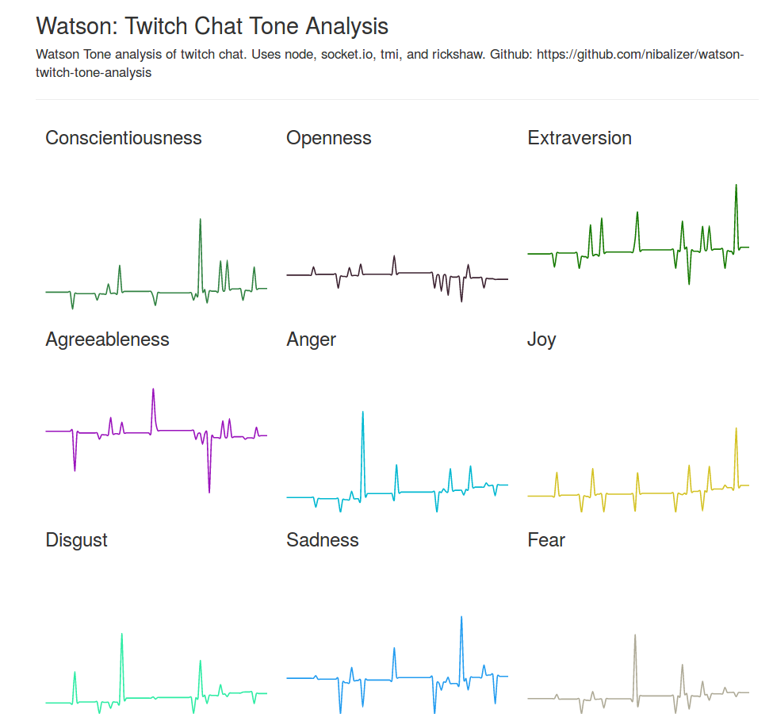

# Twitch Chat Tone Analysis

This is an example application that uses the twitch api, the watson api, socket.io, and rickshaw. It shows the tone of twitch chat accross several tone groups. Using this, a streamer can get a sense of the mood and feeling of chat at a glance.

This also demonstrates using the watson api, the twitch api, and websockets.





## Installation


### Install libraries


```shell
npm install
```


### Modify example config file


```shell
cp example.config.json config.json
vim config.json
```


### Start the server


```shell
node index.js
```
